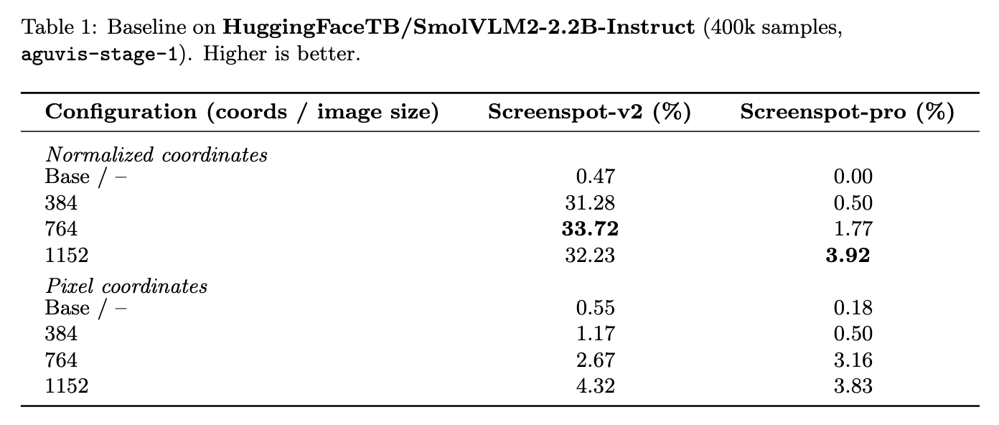
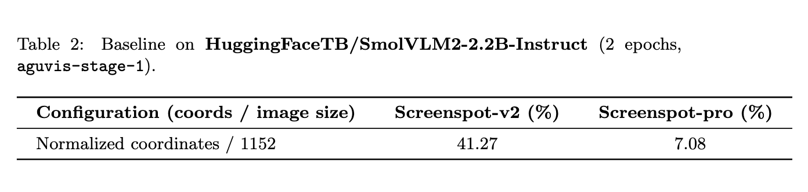

# GUI Finetune: From Zero to Agentic

## Introduction

Graphical User Interface (GUI) automation represents one of the most challenging frontiers in computer vision and AI. The ability to understand, navigate, and interact with visual interfaces opens up possibilities for AI agents to operate in any digital environment, from mobile apps to desktop software and web applications.

In this blog post, we present a comprehensive approach to training vision-language models for GUI automation through a multi-phase training strategy. We demonstrate how to transform a model with zero grounding capabilities into an agentic coder capable of understanding and interacting with graphical interfaces.

Our approach leverages **SmolVLM2-2.2B-Instruct** as the baseline model—a compact yet powerful vision-language model that initially has no grounding capabilities for GUI tasks. This makes it an ideal candidate to demonstrate the effectiveness of our training methodology. Through our two-phase training process, we first instill grounding capabilities in the model, then enhance it with agentic reasoning abilities using Supervised Fine-Tuning (SFT).

We evaluate our approach on established perception benchmarks including **ScreenSpot-v2** and **ScreenSpot-Pro**, which test the model's ability to understand and locate elements within screenshots. Our process is inspired by the [AGUVIS](https://arxiv.org/pdf/2412.04454) paper, and we leverage their carefully curated datasets to build upon their foundational work.

## 1. Data Transformation and Unified Action Space

### The Challenge of Inconsistent Action Spaces

One of the primary challenges when working with multiple GUI automation datasets is the lack of standardization in action representations. Different datasets use varying function signatures, parameter naming conventions, and action taxonomies, making it difficult to train a unified model across diverse data sources.

### Our Unified Approach

We took the open-source datasets originally used by AGUVIS and implemented a comprehensive data transformation pipeline to create a unified action space. Our approach involved:

1. **Function Parsing and Normalization**: We developed a function parser (see `utils/function_parser.py`) that can extract and parse function calls from various formats across all datasets. This parser supports any function signature format, handles complex parameter structures, and can reconstruct function calls with proper parameter ordering.

2. **Action Space Unification**: We implemented a comprehensive action conversion system (see `preprocessing/action_conversion.py`) that transforms all original action representations into a standardized function naming and argument structure. This process highlighted the significant inconsistencies in function signatures across different datasets and allowed us to:
   - Remove undesired or redundant actions
   - Standardize parameter naming conventions
   - Create a cohesive action vocabulary

3. **(Bonus) Flexible Adaptation Framework**: Our transformation pipeline includes utilities that allow users to:
   - Adapt the entire dataset to their own action space naming conventions using the `utils/action_space_converter.py` tool
   - Extract and analyze the current action space structure

### Example Data Transformation

Here are real examples from our action conversion system (`preprocessing/action_conversion.py`) showing how we transform heterogeneous action representations into our unified format:

**Before (Original Dataset Formats):**
```python
# Mobile Actions
mobile.home()
mobile.open_app(app_name='drupe')
mobile.swipe(from_coord=[0.581, 0.898], to_coord=[0.601, 0.518])
mobile.long_press(x=0.799, y=0.911)
mobile.terminate(status='success')

# Desktop Actions
pyautogui.click(x=0.8102, y=0.9463)
pyautogui.doubleClick()
pyautogui.hotkey(keys=['ctrl', 'c'])
pyautogui.scroll(page=-0.1)
pyautogui.write(message='bread buns')
pyautogui.dragTo(from_coord=[0.87, 0.423], to_coord=[0.8102, 0.9463])

# Completion Actions
answer('text')
```

**After (Unified API Format):**
```python
# Unified Mobile Actions
navigate_home()
open_app(app_name='drupe')
swipe(from_coord=[0.581, 0.898], to_coord=[0.601, 0.518])
long_press(x=0.799, y=0.911)
final_answer('success')

# Unified Desktop Actions
click(x=0.8102, y=0.9463)
double_click()
press(keys=['ctrl', 'c'])
scroll(direction='up', amount=10)  # Smart direction detection
type(text='bread buns')
drag(from_coord=[0.87, 0.423], to_coord=[0.8102, 0.9463])

# Unified Completion
final_answer('text')
```

This unification process was essential for creating coherent training data that allows the model to learn consistent action patterns across diverse GUI environments.

### (Bonus) Custom Action Space Adaptation with Action Space Converter

To maximize flexibility for different use cases, we developed the **Action Space Converter** (`utils/action_space_converter.py`) - a powerful tool that allows users to easily adapt our unified action space to their own custom action vocabularies and naming conventions.

#### Key Features

The Action Space Converter provides:

1. **Configurable Mappings**: Define custom mappings between unified actions and your preferred action names
2. **Parameter Transformation**: Rename parameters, apply value transformations, and set default values
3. **Flexible Architecture**: Support for both simple parameter mappings and complex custom transformation functions
4. **Validation**: Built-in validation to ensure mapping configurations are valid

#### Usage Example

```python
from utils.action_space_converter import ActionSpaceConverter, ActionMapping, ParameterMapping
from utils.function_parser import parse_function_call

# Create custom mappings
mappings = [
    ActionMapping(
        source_function="click",
        target_function="touch",
        parameter_mappings=[
            ParameterMapping(source_name="x", target_name="x_coord"),
            ParameterMapping(source_name="y", target_name="y_coord")
        ],
        description="Touch screen at coordinates"
    ),
    ActionMapping(
        source_function="type", # source_function is the name of the function in the original function call
        target_function="write", # target_function is the name of the function in the target function call
        parameter_mappings=[
            ParameterMapping(source_name="text", target_name="content")
            # source_name is the name of the parameter in the original function call
            # target_name is the name of the parameter in the target function call
        ],
        description="Input text"
    )
]

assistant_message = "I'll interact at those coordinates for you. click(x=0.5, y=0.3) Now I'll input the text. type(text='hello world')"

# Parse function calls
parsed_function_calls = parse_function_call(text)

# Initialize converter
converter = ActionSpaceConverter(mappings)

# Convert actions
converted_actions = converter.convert_actions(parsed_function_calls)

for new_function_call, old_function_call in zip(converted_actions, parsed_function_calls):
    text = text.replace(old_function_call.to_string(), new_function_call.to_string())

print(text)
# Output: I'll interact at those coordinates for you. touch(x=0.5, y=0.3) Now I'll input the text. write(content='hello world')
```

This tool enables researchers and practitioners to:
- **Customize Training Data**: Adapt the dataset to match their specific action vocabulary requirements
- **Domain Adaptation**: Transform actions for different platforms (mobile vs. desktop vs. web)
- **Framework Integration**: Easily align training data with existing automation frameworks
- **Rapid Experimentation**: Quickly test different action space configurations
- **Release Preparation**: Standardize action spaces for production deployment with consistent naming conventions

The Action Space Converter is particularly valuable for preparing datasets for training, as it ensures consistent action vocabularies across different deployment environments while maintaining compatibility with existing automation frameworks.

## 2. Phase 1: From Zero to Perception

### Baseline Performance Analysis

As demonstrated in our benchmark results, SmolVLM2-2.2B-Instruct initially achieved 0% performance on perception benchmarks like ScreenSpot-v1 and ScreenSpot-Pro. This complete lack of grounding capability provided us with a clean slate to evaluate the effectiveness of our training methodology.

### Optimization Experiments

Before proceeding with full-scale Phase 1 training, we conducted comprehensive ablation studies to determine optimal training configurations:

#### Image Resolution and Coordinate System Analysis

We experimented with different image sizes and coordinate representation systems to identify the optimal configuration for SmolVLM2:

- **Image Sizes Tested**: 384px, 768px, 1152px
- **Coordinate Systems**: Pixel coordinates vs. normalized coordinates (0-1 range)
- **Training Data**: 400K samples from Aguvis datasets



#### Key Findings

From our experiments, we determined that:
- **Image Size**: 1152px
- **Coordinate System**: Normalized coordinates (0-1 range) proved most effective for SmolVLM2
  - Note: The optimal choice between pixel and normalized coordinates may vary depending on the base model's pre-training approach

### Phase 1 Training Results

Using the optimal configuration (1152px resolution with normalized coordinates), we trained for 2 epochs on the smolagents/aguvis-stage-1 dataset. The results were remarkable:

- **ScreenSpot-v2**: +41% improvement over baseline
- **ScreenSpot-Pro**: +7% improvement over baseline

This dramatic improvement demonstrates that our Phase 1 training successfully instilled fundamental grounding capabilities in the model, enabling it to understand and locate visual elements within screenshots.



### Training Configuration

Our Phase 1 training used the following key parameters:
- **Epochs**: 2
- **Learning Rate**: 2.0e-05 with cosine scheduler
- **Batch Size**: 2 per device with 32 gradient accumulation steps
- **Max Sequence Length**: 16,384 tokens
- **Image Processing**: 1152px longest edge

## 3. Phase 2: Agentic Reasoning and Multi-Step Planning

### From Perception to Cognition

While Phase 1 equipped our model with grounding capabilities, Phase 2 focuses on developing agentic reasoning, the ability to think before acting. This phase transforms our model from a reactive system that can identify GUI elements into a proactive agent capable of planning and executing complex multi-step interactions.

### Enhanced Training Data

Phase 2 training utilizes the smolagents/aguvis-stage-2 dataset, which includes more complex scenarios requiring:
- **Thinking Patterns**: Training the model to explicitly reason about the current interface state and plan actions
- **Context awareness**: Maintaining state across interactions  
- **Goal-oriented planning**: Working towards specific objectives
- **Error recovery**: Handling unexpected interface states

### Training Methodology

The Phase 2 training process builds upon the Phase 1 model checkpoint and introduces:


### Results and Performance

*[Results pending - to be updated with benchmark scores from Phase 2 training]*


## 4. Open Source Training Code

We believe in the power of open science and reproducible research. All training code, data processing pipelines, and evaluation scripts are available in our repository:

### Key Components

1. **Training Recipe** (`recipe.ipynb`): Complete training pipeline for both Phase 1 and Phase 2, including dataset mixture configurations and training orchestration
2. **Action Conversion System** (`preprocessing/action_conversion.py`): Core unification engine that transforms mobile actions and PyAutoGUI desktop actions into a standardized API format. Features smart coordinate handling, direction detection for scroll actions, and comprehensive parameter normalization
3. **Function Parser** (`utils/function_parser.py`): Comprehensive utilities for parsing, normalizing, and reconstructing function calls from diverse dataset formats. Supports complex parameter structures, positional arguments, and multiple function call extraction
4. **Action Space Converter** (`utils/action_space_converter.py`): Flexible tool for adapting the unified action space to custom vocabularies and naming conventions. Enables domain-specific customization through configurable parameter mappings
5. **Data Collator** (`utils/collator.py`): Collator with masking strategy.

### Reproducibility

Our codebase includes:
- Detailed configuration files for exact reproduction
- Comprehensive documentation and examples
- Pre-processing scripts for dataset preparation with action space customization support
- Ready-to-use action space converter tool for dataset adaptation
